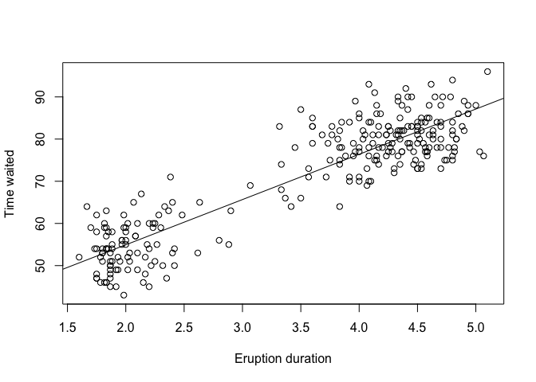

A toy example to show how we generate markdown file form Rmarkdown and share it on GitHub
================
Social Data Science 2017
10-05-2017

\#\#. Code Reference <http://www.r-tutor.com/elementary-statistics/quantitative-data/scatter-plot>

``` r
duration = faithful$eruptions      # the eruption durations 
waiting = faithful$waiting         # the waiting interval 
head(cbind(duration, waiting)) 
```

    ##      duration waiting
    ## [1,]    3.600      79
    ## [2,]    1.800      54
    ## [3,]    3.333      74
    ## [4,]    2.283      62
    ## [5,]    4.533      85
    ## [6,]    2.883      55

``` r
duration = faithful$eruptions      # the eruption durations 
waiting = faithful$waiting         # the waiting interval 
plot(duration, waiting,            # plot the variables 
  xlab="Eruption duration",        # x−axis label 
  ylab="Time waited")              # y−axis label

abline(lm(waiting ~ duration))     # add a line to show lm fitting result
```


